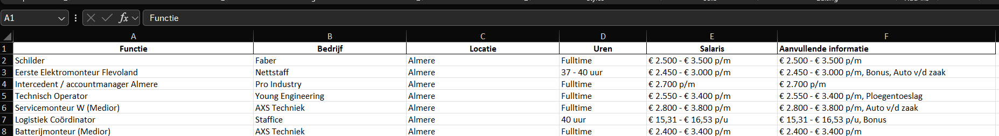

# VacatureJager
**VacatureJager** is een webscraper gemaakt in Python die vacatures verzamelt van de website https://www.werkzoeken.nl/. De scraper haalt relevante gegevens op en slaat deze op in een Excel-bestand. Hierdoor kunnen gebruikers op een gestructureerde manier vacatures bekijken en vergelijken.

## Installatie

1. Installeer Python 3.13 (64-bit)
2. Installeer de vereiste bibliotheken met: pip install -r requirements.txt.

## Resultaten
- **Functie:** (Titel van de vacature)
- **Bedrijf:** (Naam van het bedrijf dat de vacature aanbiedt)
- **Locatie:** (Locatie van de functie)
- **Uren:** (Aantal uren per week dat de functie vereist)
- **Salaris:** (Salaris dat wordt aangeboden)
- **Aanvullende Informatie:** (Extra details over de functie)

## Disclaimer
Het gebruik van deze webscraper is op eigen risico en de auteur is niet verantwoordelijk voor enige problemen die kunnen ontstaan door het gebruik van deze tool, die alleen voor educatieve doeleinden is bedoeld. 

**Belangrijke richtlijnen:**
1. **Gebruiksvoorwaarden**: Houd rekening met de gebruiksvoorwaarden van de websites die je wilt scrapen en gebruik deze tool uitsluitend voor legale en ethische doeleinden.

2. **Verantwoordelijkheid**: Bij gebruik van deze webscraper accepteer je de verantwoordelijkheid voor je eigen acties en de gevolgen daarvan.

3. **Aansprakelijkheid**: Deze tool is niet ontworpen om websites te overbelasten of te misbruiken.
