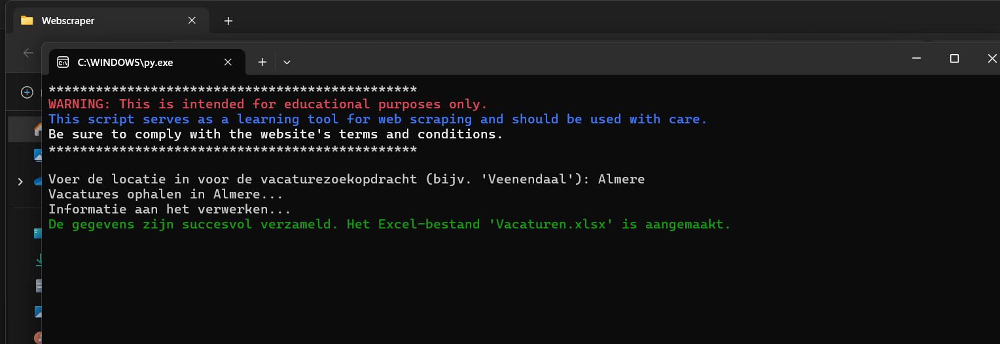

# VacatureJager
**VacatureJager** is een webscraper gemaakt in Python die vacatures verzamelt van de website https://www.werkzoeken.nl/. De scraper haalt relevante gegevens op en slaat deze op in een Excel-bestand. Hierdoor kunnen gebruikers op een gestructureerde manier vacatures bekijken en vergelijken.

## Installatie

1. Installeer Python 3.13 (64-bit)
2. Installeer de vereiste bibliotheken met: pip install -r requirements.txt.

## Excel
- **Functie:** (Titel van de vacature)
- **Bedrijf:** (Naam van het bedrijf dat de vacature aanbiedt)
- **Locatie:** (Locatie van de functie)
- **Uren:** (Aantal uren per week dat de functie vereist)
- **Salaris:** (Salaris dat wordt aangeboden)
- **Aanvullende Informatie:** (Extra details over de functie)

